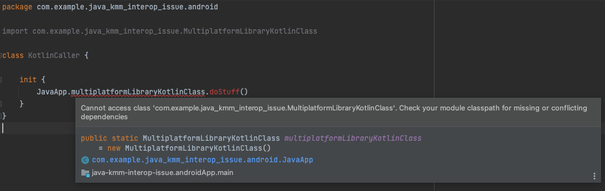

### Issue description

We have a minimal KMM project setup created by Android Studio project wizard.
There is an `:androidApp` module hosting an Android app and a `:shared` module with shared KMM code.

Environment:
- Android Studio Electric Eel 2022.1.1 Patch 1
- Kotlin Multiplatform Mobile IDE Plugin (0.5.2(221)-9)
- Kotlin 1.7.10
- Android Gradle Plugin 7.4.1

Let's have a Kotlin class declared in `:shared` KMM module:
```kotlin
class MultiplatformLibraryKotlinClass {
    fun doStuff() = Unit
}
```

In `:androidApp` module, we include the `:shared` module as a gradle dependency.
In this Android module, we have two classes.
The first one is Java class providing getter to the class defined in `:shared` module:
```java
class JavaApp {
    public static MultiplatformLibraryKotlinClass reference = new MultiplatformLibraryKotlinClass();
}
```

The second one is Kotlin class, using the `MultiplatformLibraryKotlinClass` via reference defined in Java class described above:
```kotlin
import com.example.java_kmm_interop_issue.MultiplatformLibraryKotlinClass

class KotlinCaller {
    init {
        JavaApp.multiplatformLibraryKotlinClass.doStuff()
    }
}
```

In such case, the IDE will highlight a lint error describing that the KMM class cannot be accessed, but project will compile without any issues:



This error does only occur in this specific scenario, where Kotlin file needs to access another Kotlin file defined in multiplatform module, via reference in Java file.
This is showcased in this repo by implementing other working cases. 
